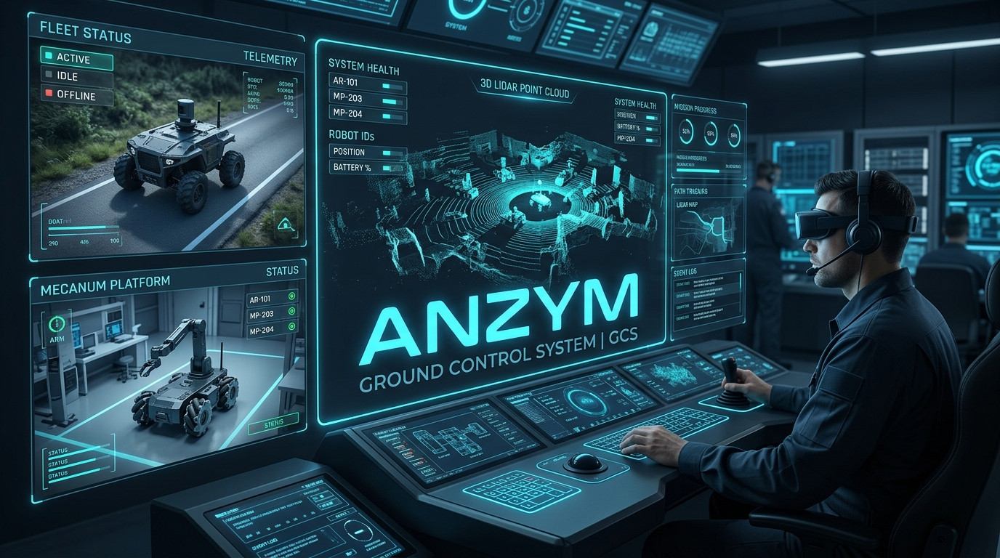

# ANZYM Ground Control System (GCS)

An enterprise multi-robot fleet management, spatial mapping, teleoperation, and diagnostics dashboard built for ROS2 mobile robots.



---

## Key Features

- **Multi-Robot Fleet Monitoring**: Live status tracking (`ONLINE`, `BUSY`, `OFFLINE`), battery telemetry, odometry position, and zero-latency heartbeat monitoring across heterogeneous fleets (NVIDIA Jetson RosOrin differential AMRs, Yahboom ROSMaster X3 Plus 4WD Mecanum AMRs).
- **Custom Vehicle Telemetry**: Native support for `/battery_state` (`sensor_msgs/msg/BatteryState`) and `gcs_interfaces/msg/VehicleBaselineStatus` — battery voltage, state of charge, link quality (RSSI, jitter, packet loss), flight modes, safety flags, and RTK lock status.
- **Zero-Latency Dual-Mode Teleoperation**: Dual-mode Joystick teleoperation (`LOCAL` direct vs. `GCS_REMOTE` over rosbridge WebSocket) supporting both 2-DOF differential drive and 3-DOF Holonomic Mecanum (forward/back, lateral strafe, yaw rotation) with integrated safety watchdog failsafes.
- **Ultra-Low Latency Video Streaming**: Primary WebRTC streaming via WHEP (MediaMTX on port 8889, `<200ms` latency) with automatic fallback to HTTP MJPEG (`web_video_server` on port 8080).
- **Interactive LiDAR & Spatial Mapping**: 2D LaserScan visualization canvas with mouse wheel zoom (40% to 500%), click-and-drag pan, and navigation waypoint targeting.
- **Foxglove Studio 3D Integration**: 1-click launcher for host desktop Foxglove Studio (`foxglove://` deep links) with standard `rosbridge-websocket` protocol support and pre-configured 3D LiDAR layouts (`/api/foxglove-lidar-layout.json`).
- **Live Topic Echo Inspector**: Real-time ROS2 message inspector for `/scan`, `/odom`, `/tf`, `/tf_static`, `/battery_state`, `/vehicle/baseline_status`, `/cmd_vel`, `/teleop_mode_status`, and custom topics.
- **Template & Plugin Architecture**: Dynamic YAML template-driven platform instantiation system for Jetson Orin AMRs (`anzym_rosorin`), Yahboom ROSMaster X3 Plus Mecanum AMRs (`anzym_x3` / `anzym_x3_plus`), and Micro-AMRs (`anzym_zumo`).

---

## Quick Start

The recommended approach runs **infrastructure** (PostgreSQL, Redis, InfluxDB, MinIO) in Docker while running the **backend and frontend natively** on the host. This avoids Docker bridge network isolation issues when the backend needs to reach robots on the LAN.

### 1. Start Infrastructure Services
```bash
docker compose up -d postgres redis influxdb minio
```

### 2. Start Backend (native)
```bash
cd backend
python3 -m venv .venv
source .venv/bin/activate
pip install -e ".[dev]"

uvicorn app.main:app --host 0.0.0.0 --port 8000 --reload
```

### 3. Start Frontend (native)
```bash
cd frontend
npm install
npm run dev
```

### 4. Access Web Interface
Open your browser and navigate to:
- **GCS Frontend**: [http://localhost:5173](http://localhost:5173)
- **FastAPI Backend API**: [http://localhost:8000](http://localhost:8000)
- **FastAPI Interactive Docs**: [http://localhost:8000/docs](http://localhost:8000/docs)

### 5. Check System Logs & Status
```bash
# Check service status
./start_gcs.sh --status

# Backend logs appear in logs/backend.log
# Frontend logs appear in logs/frontend.log
# Infrastructure logs:
docker compose logs -f redis postgres
```

### 6. Stop / Shutdown GCS
```bash
./shutdown_gcs.sh
# or: ./stop_gcs.sh
```

> **Note:** You can also run the full stack in Docker with `docker compose up --build -d`, but the backend container must be able to reach the robot's IP (e.g., `192.168.8.162`) which requires `network_mode: host` or custom Docker networking.

---

## Full Docker Compose (Alternative)

If you prefer running everything in Docker:

```bash
docker compose up --build -d
```

> **Warning:** The default `docker-compose.yml` uses a bridge network. The backend container won't be able to reach robots on the LAN (e.g., `192.168.8.162`) unless you add `network_mode: host` to the backend service or configure routing.


---

## Robot Platform Configuration & Templates

The GCS automatically discovers and registers configured fleet robots on boot:
- **`rosorin-01`** (`RosOrin-Alpha` at `192.168.8.162:9090`): Jetson Orin Differential AMR with Intel RealSense D435i, 2D LiDAR, and WebRTC streaming.
- **`x3-01`** (`AnZym-Green-X3` at `192.168.8.246:9090`): Yahboom ROSMaster X3 Plus 4WD Mecanum AMR + 6-DOF Arm with Astra Pro Plus depth camera, YDLidar TG30, and WebRTC streaming.

You can also instantiate new platforms using pre-built templates via the UI or API:

```http
POST /api/robots/register-from-template
Content-Type: application/json

{
  "robot_id": "x3-01",
  "robot_name": "AnZym-Green-X3",
  "template_id": "anzym_x3",
  "host": "192.168.8.246",
  "port": 9090
}
```

For detailed instructions on authoring custom robot platform templates and plugins, see [docs/TEMPLATES.md](docs/TEMPLATES.md).

---

## Teleoperation Modes (Differential & Mecanum)

- **`LOCAL` (Default)**: Local joystick hardware connected directly to the robot or workstation publishes to `/cmd_vel_local` / `/joy/cmd_vel`. The onboard `teleop_mode_switcher` passes commands directly to `/cmd_vel` without network latency.
- **`GCS_REMOTE`**: GCS Web Gamepad streams velocity commands (`/gcs/cmd_vel`) at 20 Hz (50 ms intervals) over rosbridge.
  - **Differential Drive** (`anzym_rosorin`): `linear.x` (forward/back) and `angular.z` (yaw).
  - **Holonomic Mecanum** (`anzym_x3` / `anzym_x3_plus`): `linear.x` (forward/back), `linear.y` (lateral strafe), and `angular.z` (yaw).
  - **Failsafe Watchdog**: If GCS commands cease for `> 2.0s` while in `GCS_REMOTE` mode, the robot halts immediately and falls back to `LOCAL` mode automatically.

---

## Foxglove Studio 3D Visualization

1. In the Mapping panel, click **`Foxglove Studio 3D`**.
2. Click **`Launch Foxglove Desktop App`** to trigger the workstation's native Foxglove Studio via `foxglove://` deep link protocol.
3. Click **`Download 3D LiDAR Layout`** to download `foxglove_lidar_layout.json` and import it in Foxglove Studio (`Layout` -> `Import from file...`).
4. Ensure the connection is set to `ws://<robot_host>:8765` using the **Foxglove WebSocket** driver, or `ws://<robot_host>:9090` using the **Rosbridge (ROS 1/2)** driver.

---

## System Architecture

```text
+-----------------------------------------------------------------------------------+
|                              GCS React Frontend                                   |
|       (Dashboard, MapCanvas, WebRTC/MJPEG Video Player, Topic Inspector)          |
+-----------------------------------------+-----------------------------------------+
                                          | WebSocket (/ws/fleet) / HTTP REST
+-----------------------------------------v-----------------------------------------+
|                               FastAPI Backend                                     |
|              (ROSbridgeManager, TelemetryService, TemplateManager)                |
+---+--------------------+--------------------+--------------------+----------------+
    |                    |                    |                    |
+---v---+            +---v----+           +---v---+            +---v---+
|Postgres|           | Redis  |           |InfluxDB|           | MinIO |
| (SQL)  |           |(PubSub)|           | (TSDB)|            |  (S3) |
+--------+           +--------+           +-------+            +-------+
                         |                    |
        WebSocket (rosbridge JSON :9090)      | WebRTC WHEP (:8889) / MJPEG (:8080)
    +--------------------+--------------------+--------------------+
    |                                                              |
+---v-----------------------------------+   +----------------------v----------------+
|    ROS2 Jetson Robot (RosOrin)        |   |    ROS2 Jetson Robot (AnZym Green)    |
|  - rosbridge:9090  web_video:8080     |   |  - rosbridge:9090  mediamtx:8889      |
|  - Differential Drive AMR             |   |  - 4WD Mecanum AMR + 6-DOF Arm        |
|  - /battery_state  /scan  /tf  /odom  |   |  - /battery_state  /scan  /camera/... |
|  - teleop_mode_switcher (/cmd_vel)    |   |  - teleop_mode_switcher (/cmd_vel)    |
+---------------------------------------+   +---------------------------------------+
```

For in-depth architecture details, see [docs/architecture.md](docs/architecture.md).
