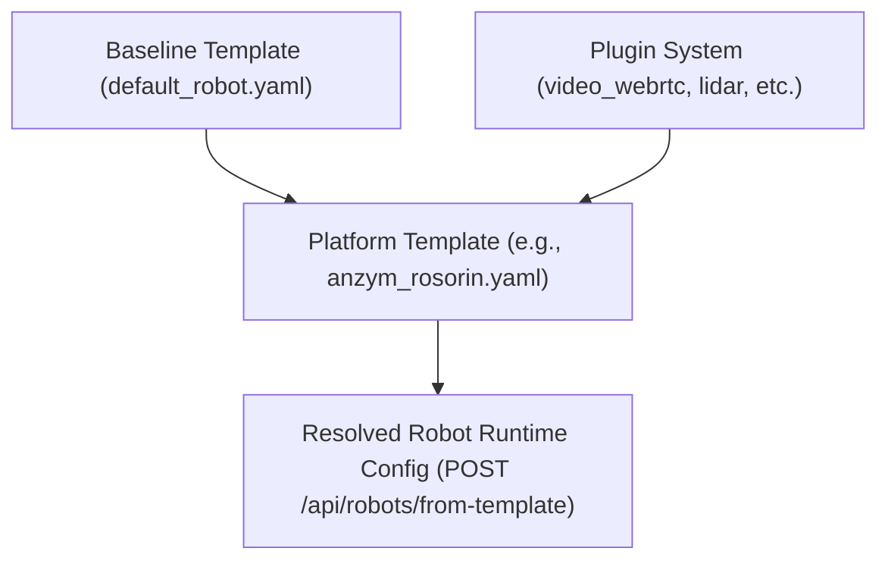

# Robot Platform Templates & Plugin Architecture

The **ANZYM Ground Control System (GCS)** uses a modular, template-driven architecture to configure, register, and manage diverse ROS2 mobile robot platforms.

---

## 1. Overview of Template System

The template system is composed of three hierarchical layers located in `backend/templates/`:

```text
backend/templates/
├── baseline/
│   └── default_robot.yaml      # Baseline default specifications inherited by all platforms
├── platforms/
│   ├── anzym_rosorin.yaml      # Jetson Orin AMR platform specification
│   └── anzym_zumo.yaml         # Compact Micro-AMR platform specification
└── plugins/
    ├── foxglove_visualizer.yaml # Foxglove Studio 3D visualization plugin
    ├── gamepad_teleop.yaml      # HTML5 Gamepad / Joystick teleoperation plugin
    ├── lidar_2d_3d.yaml         # 2D/3D LiDAR scan processing plugin
    └── video_webrtc.yaml        # Low-latency WebRTC video streaming plugin
```

---

## 2. Template Hierarchy & Resolution Order



1. **Baseline Defaults**: Found in `backend/templates/baseline/default_robot.yaml`. Sets universal fallback settings (teleop watchdog timeouts, default rosbridge ports, default velocity limits).
2. **Platform Specifications**: Defined in `backend/templates/platforms/*.yaml`. Extends the baseline default, overrides physical capabilities, camera specs, and specifies recommended plugins.
3. **Plugin Definitions**: Defined in `backend/templates/plugins/*.yaml`. Modular features enabled per platform (e.g., WebRTC streaming, LiDAR scan rendering, Foxglove Studio integration).

---

## 3. Platform Template Specification (`.yaml`)

Below is the standard specification for an ANZYM robot platform template:

```yaml
id: anzym_rosorin
name: ANZYM RosOrin AMR Platform
version: "1.0.0"
category: "differential_drive_amr"
description: Industrial Autonomous Mobile Robot powered by NVIDIA Jetson Orin with onboard camera, 2D LiDAR, and ROS2.
baseline_ref: default_robot

# Recommended default plugins to activate
recommended_plugins:
  - video_webrtc
  - foxglove_visualizer
  - lidar_2d_3d
  - gamepad_teleop

# Hardware capabilities flag
capabilities:
  has_camera: true
  has_lidar: true
  has_nav2: true
  has_foxglove: true
  drive_type: "differential"

# Camera feed & stream specifications
camera_specs:
  model: "Intel RealSense D435i / Orin CSI"
  topics:
    color: "/camera/color/image_raw"
    depth: "/camera/depth/image_rect_raw"
  webrtc_enabled: true
  webrtc_port: 8554

# Default ROS2 topics monitored by GCS
default_topics:
  - topic: "/camera/color/image_raw"
    type: "sensor_msgs/msg/Image"
    rate_limit_hz: 30
  - topic: "/scan"
    type: "sensor_msgs/msg/LaserScan"
    rate_limit_hz: 15
  - topic: "/amcl_pose"
    type: "geometry_msgs/msg/PoseWithCovarianceStamped"
    rate_limit_hz: 10
```

---

## 4. How to Create a New Robot Platform Template

To add support for a new robot type (e.g., `my_custom_robot`):

1. Create a new YAML file in `backend/templates/platforms/my_custom_robot.yaml`.
2. Define the platform `id`, `name`, `capabilities`, and `default_topics`.
3. Save the file. The backend `TemplateManager` dynamically discovers all `.yaml` files in `backend/templates/platforms/` without requiring code changes or server restarts!

---

## 5. API Usage & Registration

### List Available Templates & Plugins
```http
GET /api/templates
```
**Response**:
```json
{
  "platforms": [
    {
      "id": "anzym_rosorin",
      "name": "ANZYM RosOrin AMR Platform",
      "recommended_plugins": ["video_webrtc", "foxglove_visualizer", "lidar_2d_3d", "gamepad_teleop"]
    }
  ],
  "plugins": [
    {"id": "video_webrtc", "name": "WebRTC Low-Latency Video Streaming"},
    {"id": "foxglove_visualizer", "name": "Foxglove Studio 3D Integration"}
  ]
}
```

### Instantiate Robot from Template
```http
POST /api/robots/from-template
Content-Type: application/json

{
  "robot_id": "rosorin-01",
  "name": "RosOrin-Alpha",
  "template_id": "anzym_rosorin",
  "host": "192.168.8.162",
  "port": 9090
}
```
**Response**: Automatically synthesizes the baseline, resolves active plugins, registers the robot, and establishes WebSocket connection over rosbridge!
