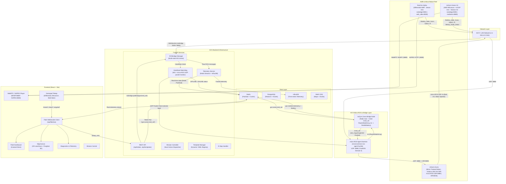

# Centralized Ground Control System (GCS) - Architecture Documentation

## 1. System Architecture Diagram



## 2. Database Schema

### 2.1 PostgreSQL Schema (SQLAlchemy Models)

```python
# backend/app/models/database.py
from sqlalchemy import (
    Column, Integer, String, Float, Boolean, DateTime,
    ForeignKey, Text, JSON, Index
)
from sqlalchemy.orm import declarative_base, relationship
from datetime import datetime
import enum

Base = declarative_base()


class RobotStatus(str, enum.Enum):
    ONLINE = "ONLINE"
    OFFLINE = "OFFLINE"
    BUSY = "BUSY"
    ERROR = "ERROR"
    CHARGING = "CHARGING"


class MissionStatus(str, enum.Enum):
    PENDING = "PENDING"
    ACTIVE = "ACTIVE"
    COMPLETED = "COMPLETED"
    FAILED = "FAILED"
    CANCELLED = "CANCELLED"


class Robot(Base):
    __tablename__ = "robots"

    id = Column(String(36), primary_key=True)
    name = Column(String(100), nullable=False, index=True)
    serial_number = Column(String(50), unique=True, nullable=False, index=True)
    status = Column(String(20), default=RobotStatus.OFFLINE, index=True)
    last_seen_at = Column(DateTime, default=datetime.utcnow, onupdate=datetime.utcnow)
    current_mission_id = Column(String(36), ForeignKey("missions.id"), nullable=True)
    created_at = Column(DateTime, default=datetime.utcnow)
    updated_at = Column(DateTime, default=datetime.utcnow, onupdate=datetime.utcnow)

    # Relationships
    missions = relationship("Mission", back_populates="robot", foreign_keys="Mission.robot_id")
    maps = relationship("MapAsset", back_populates="robot")
    current_mission = relationship("Mission", back_populates="robot_current",
                                    foreign_keys=[current_mission_id], overlay="update")


class Mission(Base):
    __tablename__ = "missions"

    id = Column(String(36), primary_key=True)
    robot_id = Column(String(36), ForeignKey("robots.id"), nullable=False, index=True)
    name = Column(String(200), nullable=False)
    waypoints = Column(JSON, nullable=False)  # Array of {x, y, theta, timestamp}
    status = Column(String(20), default=MissionStatus.PENDING, index=True)
    created_at = Column(DateTime, default=datetime.utcnow)
    completed_at = Column(DateTime, nullable=True)
    error_log = Column(Text, nullable=True)
    acknowledgment_log = Column(JSON, default=list)  # Track goal acks

    # Relationships
    robot = relationship("Robot", back_populates="missions", foreign_keys=[robot_id])
    robot_current = relationship("Robot", back_populates="current_mission",
                                  foreign_keys=[Robot.current_mission_id],
                                  overlay="update")


class MapAsset(Base):
    __tablename__ = "map_assets"

    id = Column(String(36), primary_key=True)
    robot_id = Column(String(36), ForeignKey("robots.id"), nullable=False, index=True)
    map_type = Column(String(10), nullable=False)  # "2D" or "3D"
    s3_key = Column(String(500), nullable=False)
    format = Column(String(20), default="yaml")  # yaml, pgm, ply, etc.
    resolution = Column(Float, nullable=True)
    width = Column(Integer, nullable=True)
    height = Column(Integer, nullable=True)
    uploaded_at = Column(DateTime, default=datetime.utcnow)

    # Relationships
    robot = relationship("Robot", back_populates="maps")

    __table_args__ = (
        Index("idx_map_assets_robot_type", "robot_id", "map_type"),
    )


class TelemetrySnapshot(Base):
    """
    Persistent telemetry snapshots for long-term storage.
    High-frequency telemetry goes to InfluxDB; this table
    stores periodic snapshots (e.g., every 60 seconds).
    """
    __tablename__ = "telemetry_snapshots"

    id = Column(Integer, primary_key=True, autoincrement=True)
    robot_id = Column(String(36), ForeignKey("robots.id"), nullable=False, index=True)
    timestamp = Column(DateTime, default=datetime.utcnow, index=True)
    battery_level = Column(Float, nullable=True)
    cpu_load = Column(Float, nullable=True)
    memory_usage = Column(Float, nullable=True)
    disk_usage = Column(Float, nullable=True)
    nav_velocity = Column(Float, default=0.0)
    connection_quality = Column(Float, nullable=True)  # 0.0 - 1.0

    robot = relationship("Robot")
```

### 2.2 InfluxDB Schema (Telegraf-style Telegraps)

```python
# backend/app/models/telemetry.py
"""
InfluxDB measurement schema for high-frequency telemetry.

Measurement: telemetry
Tags: robot_id, robot_name
Fields: battery_level, cpu_load, memory_usage, disk_usage,
        nav_velocity_x, nav_velocity_y, nav_theta,
        connection_quality, active_connections
Timestamp: auto (UTC)
"""

TELEMETRY_MEASUREMENT = "telemetry"

TELEMETRY_TAGS = ["robot_id", "robot_name"]

TELEMETRY_FIELDS = [
    "battery_level",       # float 0-100
    "cpu_load",            # float 0-100
    "memory_usage",        # float 0-100
    "disk_usage",          # float 0-100
    "nav_velocity_x",      # float (m/s)
    "nav_velocity_y",      # float (m/s)
    "nav_theta",           # float (radians)
    "connection_quality",  # float 0-1
    "active_connections",  # int
]


# Diagnostic events measurement
DIAGNOSTIC_MEASUREMENT = "diagnostics"

DIAGNOSTIC_TAGS = ["robot_id", "level", "source"]

DIAGNOSTIC_FIELDS = [
    "value",       # numeric diagnostic value
    "message",     # string diagnostic message
]
```

### 2.3 TypeScript Interfaces (Frontend)

```typescript
// frontend/src/types/robot.ts

export interface Waypoint {
  x: number;
  y: number;
  theta: number;
  timestamp?: string;
}

export interface DiagnosticStatus {
  level: 0 | 1 | 2 | 3; // OK, Warn, Error, Fatal
  name: string;
  message: string;
  values?: DiagnosticKeyValue[];
}

export interface DiagnosticKeyValue {
  key: string;
  value: string;
}

export interface RobotState {
  id: string;
  name: string;
  serial_number: string;
  status: 'ONLINE' | 'OFFLINE' | 'BUSY' | 'ERROR' | 'CHARGING';
  battery: number;
  position: { x: number; y: number; theta: number };
  lastSeen: string;
  currentMissionId?: string;
  diagnostics: DiagnosticStatus[];
  cpuLoad?: number;
  memoryUsage?: number;
  host?: string;  // Robot's LAN IP for direct MJPEG video access
}

export interface Mission {
  id: string;
  robot_id: string;
  name: string;
  waypoints: Waypoint[];
  status: 'PENDING' | 'ACTIVE' | 'COMPLETED' | 'FAILED' | 'CANCELLED';
  created_at: string;
  completed_at?: string;
  error_log?: string;
  acknowledgment_log?: GoalAck[];
}

export interface GoalAck {
  waypoint_index: number;
  status: 'SENT' | 'ACCEPTED' | 'REACHED' | 'REJECTED' | 'TIMED_OUT';
  timestamp: string;
}

export interface MapAsset {
  id: string;
  robot_id: string;
  map_type: '2D' | '3D';
  s3_key: string;
  format: string;
  resolution?: number;
  width?: number;
  height?: number;
  uploaded_at: string;
}

export interface FleetState {
  robots: Record<string, RobotState>;
  activeMissionId?: string;
  selectedRobotId?: string;
}
```

## 3. ROS2 Topic Filtering Configuration

### 3.1 rosbridge Topic Allowlist

```yaml
# backend/config/rosbridge_topics.yaml
# Configuration for rosbridge WebSocket message filtering
# Only messages on these topics will be forwarded to the GCS backend

allowed_topics:
  # Telemetry & State
  - topic: "/battery_state"
    type: "sensor_msgs/msg/BatteryState"
    rate_limit: 10  # Hz max

  - topic: "/diagnostics"
    type: "diagnostic_msgs/msg/DiagnosticArray"
    rate_limit: 5

  - topic: "/tf"
    type: "tf2_msgs/msg/TFMessage"
    rate_limit: 10

  - topic: "/tf_static"
    type: "tf2_msgs/msg/TFMessage"
    rate_limit: 1

  # Navigation
  - topic: "/nav_msgs/Path"
    type: "nav_msgs/msg/Path"
    rate_limit: 5

  - topic: "/geometry_msgs/PoseStamped"
    type: "geometry_msgs/msg/PoseStamped"
    rate_limit: 10

  - topic: "/amcl_pose"
    type: "geometry_msgs/msg/PoseWithCovarianceStamped"
    rate_limit: 10

  - topic: "/cmd_vel"
    type: "geometry_msgs/msg/Twist"
    rate_limit: 20

  # Robot state
  - topic: "/odom"
    type: "nav_msgs/msg/Odometry"
    rate_limit: 10

  - topic: "/nav_msgs/Odometry"
    type: "nav_msgs/msg/Odometry"
    rate_limit: 10

  # System monitoring
  - topic: "/cpu_load"
    type: "std_msgs/msg/Float64"
    rate_limit: 5

  - topic: "/memory_usage"
    type: "std_msgs/msg/Float64"
    rate_limit: 5

  # Vehicle telemetry (custom gcs_interfaces)
  - topic: "/vehicle/baseline_status"
    type: "gcs_interfaces/msg/VehicleBaselineStatus"
    rate_limit: 1

allowed_services:
  - service: "/std_srvs/SetBool"
    type: "std_srvs/srv/SetBool"

  - service: "/nav2_behavior_tree/cancel_goal"
    type: "tier4_autoware_api/srv/CancelGoal"

  - service: "/robot_state_publisher/get_loggers"
    type: "rcl_interfaces/srv/GetLoggers"

blocked_patterns:
  # Block high-bandwidth sensor data
  - "*camera*image*"
  - "*camera*rgb*"
  - "*camera*depth*"
  - "*lidar*points*"
  - "*points*"
  - "*compressed*"
  - "*theora*"

# Per-topic throttle rates for rosbridge subscriptions (milliseconds).
# 0 = no throttle. High-frequency topics should be throttled to prevent
# WebSocket flooding and backpressure.
throttle_rates:
  "/scan": 200        # LiDAR: cap at ~5 Hz
  "/tf": 200          # TF: cap at ~5 Hz
  "/odom": 100        # Odometry: cap at ~10 Hz
  "/tf_static": 0     # Static transforms: every message
  "/battery_state": 0 # Battery: every message
  "/vehicle/baseline_status": 0  # Custom telemetry: every message

rosbridge_config:
  max_message_size: 1048576  # 1 MB
  frame_timeout: 0.5
  authenticate: false
  unix: false
```

### 3.2 rosbridge_params.json (Per-Robot Configuration)

```json
{
  "rosbridge_kwargs": {
    "host": "0.0.0.0",
    "port": 9090,
    "max_message_size": 1048576,
    "delay_between_messages": 0
  },
  "topics": {
    "subscribe": [
      "/battery_state",
      "/vehicle/baseline_status",
      "/diagnostics",
      "/tf",
      "/nav_msgs/Path",
      "/geometry_msgs/PoseStamped",
      "/amcl_pose",
      "/cmd_vel",
      "/odom"
    ],
    "publish": [
      "/cmd_vel",
      "/gcs/cmd_vel",
      "/geometry_msgs/PoseStamped",
      "/nav_msgs/Path"
    ],
    "services": [
      "/std_srvs/SetBool"
    ]
  }
}
```

## 4. Future Spatial Mapping, LiDAR & Nav2 Integration Roadmap

To support advanced autonomous robotics operations, the GCS Mapping section is architected for phased spatial visualization as SLAM and Nav2 navigation suites are deployed on fleet platforms.

### 4.1 LiDAR LaserScan & PointCloud Stream Pipeline
- **2D LaserScan (`/scan`)**: Rendered directly on the `MapCanvas` 2D view as point clusters relative to the robot TF frame `base_link`.
- **3D PointCloud2 (`/points2`)**: High-bandwidth point cloud streams are routed over `foxglove_bridge` (port 8765) using binary CDR encoding, bypassing JSON rosbridge serialization overhead.

### 4.2 Nav2 OccupancyGrid & Costmap Visualization
- **Global SLAM Map (`/map`)**: Ingested as a 2D `nav_msgs/msg/OccupancyGrid` PNG/PGM asset or WebP tile stream, rendered as the base background layer in `MapCanvas` and Foxglove.
- **Dynamic Costmaps (`/global_costmap/costmap`, `/local_costmap/costmap`)**: Rendered as semi-transparent heatmaps indicating static/dynamic obstacle inflation zones around the robot.

### 4.3 Nav2 Autonomous Path & Action Dispatch
- **Action Server**: GCS backend dispatches Nav2 goals directly to `nav2_msgs/action/NavigateToPose` or `nav2_msgs/action/NavigateThroughPoses`.
- **Planned Path Rendering**: Subscribes to `nav_msgs/msg/Path` on `/plan` to render real-time planned trajectory vectors and waypoint goal indicators.

---

## 5. AnZym Zumo Micro-ROS System Integration & Control Architecture

The **AnZym Zumo** is a tracked micro-AMR operating exclusively via Wi-Fi GCS teleoperation, powered by an **Arduino UNO R4 WiFi** (Renesas RA4M1 48MHz + ESP32-S3 Wi-Fi co-processor) and a **Pololu Zumo Shield v1.2** with a Texas Instruments **DRV8835** dual motor driver.

### 5.1 Communication Pipeline & Network Protocol

```text
┌────────────────────────┐      UDP :8888       ┌────────────────────────┐
│  AnZym Zumo Robot      │ ◄──────────────────► │  micro-ROS Agent       │
│  (Arduino UNO R4 WiFi) │  (Wi-Fi 2.4 GHz)     │  (Docker Daemon :8888) │
└────────────────────────┘                      └───────────┬────────────┘
                                                            │ FastDDS Domain 0
                                                ┌───────────▼────────────┐
                                                │  Zumo GCS Bridge Node  │
                                                │  (FastDDS Domain 0)    │
                                                └───────────▲────────────┘
                                                            │ Redis Pub/Sub
                                                ┌───────────┴────────────┐
                                                │  GCS FastAPI Backend   │
                                                │  (/api/fleet/ws)       │
                                                └───────────▲────────────┘
                                                            │ WebSocket JSON
                                                ┌───────────┴────────────┐
                                                │  GCS React Frontend    │
                                                │  (Dashboard Gamepad)   │
                                                └────────────────────────┘
```

### 5.2 Micro-ROS Topics & Message Specifications

| Topic | Type | Direction | QoS | Frequency | Description |
|:---|:---|:---|:---|:---|:---|
| `/cmd_vel` | `std_msgs/msg/Int32` | GCS $\rightarrow$ Zumo | `BEST_EFFORT` | 20 Hz | Packed 32-bit integer containing 16-bit steering & 16-bit throttle. |
| `/zt` | `std_msgs/msg/Float32MultiArray` | Zumo $\rightarrow$ GCS | `BEST_EFFORT` | 10 Hz | `[battery_mv, current_left_speed, current_right_speed]` telemetry. |
| `/zumo/battery_state` | `sensor_msgs/msg/BatteryState` | Bridge $\rightarrow$ GCS | `RELIABLE` | 10 Hz | Standard ROS2 battery percentage and voltage for fleet monitor. |

### 5.3 Packed 32-Bit Motor Control Protocol

To eliminate serialization overhead and dynamic heap allocations on the embedded microcontroller, motor commands are bit-packed into a single 32-bit integer:

$$\text{Packed Int32} = (\text{Steering}_{16} \ll 16) \mid (\text{Throttle}_{16} \ \& \ \text{0xFFFF})$$

- **Throttle** (Bits 0–15): Signed 16-bit integer ($-255$ to $+255$).
- **Steering** (Bits 16–31): Signed 16-bit integer ($-255$ to $+255$).
- **Onboard Unpacking & Motor Mixing**:
  $$\text{Left Motor Speed} = \text{constrain}(\text{Throttle} - \text{Steering}, -255, 255)$$
  $$\text{Right Motor Speed} = \text{constrain}(\text{Throttle} + \text{Steering}, -255, 255)$$

### 5.4 Safety Watchdogs & Slew Rate Smoothing
1. **Bridge Slew Rate Limiter**: Ramps motor throttle and steering across $\pm 35\text{ PWM/step}$ at 20 Hz to protect mechanical gears and prevent current spikes.
2. **Bridge 1.0s Watchdog**: Automatically zeroes velocity targets if gamepad commands cease for $>1.0\text{s}$.
3. **Onboard 2.0s Failsafe**: The Arduino microcontroller automatically cuts PWM outputs to zero if no micro-ROS UDP packets arrive for $>2.0\text{s}$.
4. **Backend UDP Packet Watchdog**: GCS backend inspects live micro-ROS agent UDP packet reception timestamps and marks the robot `ONLINE` or `OFFLINE` dynamically with a 3.5s timeout.